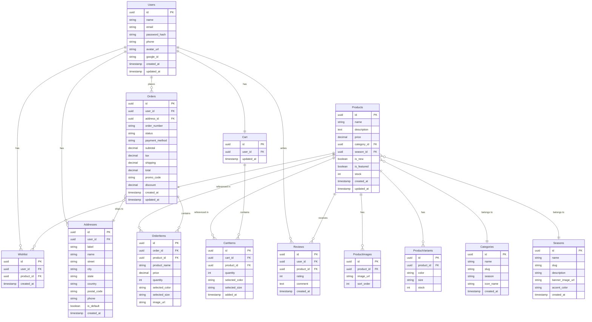

# NORDEN – Maison de Luxe: Database Schema

> Relational schema (PostgreSQL / SQLite compatible).  
> All tables include `created_at` and `updated_at` timestamps unless otherwise noted.  
> All IDs are UUIDs unless otherwise noted.

---

## Entity Relationship Diagram



---

## Tables

### users

| Column          | Type         | Constraints                           |
| --------------- | ------------ | ------------------------------------- |
| `id`            | UUID         | PK, DEFAULT gen_random_uuid()         |
| `name`          | VARCHAR(120) | NOT NULL                              |
| `email`         | VARCHAR(255) | NOT NULL, UNIQUE                      |
| `password_hash` | VARCHAR(255) | NULLABLE (null for Google-only users) |
| `phone`         | VARCHAR(30)  | NULLABLE                              |
| `avatar_url`    | TEXT         | NULLABLE                              |
| `google_id`     | VARCHAR(120) | NULLABLE, UNIQUE                      |
| `created_at`    | TIMESTAMP    | DEFAULT NOW()                         |
| `updated_at`    | TIMESTAMP    | DEFAULT NOW()                         |

---

### categories

| Column       | Type        | Constraints                                       |
| ------------ | ----------- | ------------------------------------------------- |
| `id`         | UUID        | PK                                                |
| `name`       | VARCHAR(80) | NOT NULL                                          |
| `slug`       | VARCHAR(80) | NOT NULL, UNIQUE                                  |
| `season`     | VARCHAR(20) | CHECK IN ('winter','summer','all'), DEFAULT 'all' |
| `icon_name`  | VARCHAR(60) | NULLABLE                                          |
| `created_at` | TIMESTAMP   | DEFAULT NOW()                                     |

**Seed data:**

```sql
INSERT INTO categories (slug, name, season) VALUES
  ('suits',       'Suits',        'all'),
  ('blazers',     'Blazers',      'all'),
  ('dress-shirts','Dress Shirts', 'all'),
  ('trousers',    'Trousers',     'all'),
  ('coats',       'Coats',        'winter'),
  ('accessories', 'Accessories',  'all');
```

---

### seasons

| Column             | Type        | Constraints                                    |
| ------------------ | ----------- | ---------------------------------------------- |
| `id`               | UUID        | PK                                             |
| `name`             | VARCHAR(80) | NOT NULL                                       |
| `slug`             | VARCHAR(20) | NOT NULL, UNIQUE, CHECK IN ('winter','summer') |
| `description`      | TEXT        | NULLABLE                                       |
| `banner_image_url` | TEXT        | NULLABLE                                       |
| `accent_color`     | VARCHAR(10) | DEFAULT '#D4AF37'                              |
| `created_at`       | TIMESTAMP   | DEFAULT NOW()                                  |

---

### products

| Column        | Type          | Constraints                            |
| ------------- | ------------- | -------------------------------------- |
| `id`          | UUID          | PK                                     |
| `name`        | VARCHAR(180)  | NOT NULL                               |
| `description` | TEXT          | NULLABLE                               |
| `price`       | DECIMAL(10,2) | NOT NULL, CHECK > 0                    |
| `category_id` | UUID          | FK → categories.id, ON DELETE SET NULL |
| `season_id`   | UUID          | FK → seasons.id, ON DELETE SET NULL    |
| `is_new`      | BOOLEAN       | DEFAULT FALSE                          |
| `is_featured` | BOOLEAN       | DEFAULT FALSE                          |
| `stock`       | INTEGER       | DEFAULT 0, CHECK >= 0                  |
| `created_at`  | TIMESTAMP     | DEFAULT NOW()                          |
| `updated_at`  | TIMESTAMP     | DEFAULT NOW()                          |

**Indexes:**

- `idx_products_category` on `category_id`
- `idx_products_season` on `season_id`
- `idx_products_featured` on `is_featured`
- Full-text index on `(name, description)`

---

### product_images

| Column       | Type    | Constraints                         |
| ------------ | ------- | ----------------------------------- |
| `id`         | UUID    | PK                                  |
| `product_id` | UUID    | FK → products.id, ON DELETE CASCADE |
| `image_url`  | TEXT    | NOT NULL                            |
| `sort_order` | INTEGER | DEFAULT 0                           |

---

### product_variants

| Column       | Type                            | Constraints                         |
| ------------ | ------------------------------- | ----------------------------------- |
| `id`         | UUID                            | PK                                  |
| `product_id` | UUID                            | FK → products.id, ON DELETE CASCADE |
| `color`      | VARCHAR(50)                     | NOT NULL                            |
| `size`       | VARCHAR(10)                     | NOT NULL                            |
| `stock`      | INTEGER                         | DEFAULT 0                           |
| UNIQUE       | (`product_id`, `color`, `size`) |                                     |

---

### reviews

| Column       | Type                      | Constraints                         |
| ------------ | ------------------------- | ----------------------------------- |
| `id`         | UUID                      | PK                                  |
| `user_id`    | UUID                      | FK → users.id, ON DELETE CASCADE    |
| `product_id` | UUID                      | FK → products.id, ON DELETE CASCADE |
| `rating`     | SMALLINT                  | NOT NULL, CHECK BETWEEN 1 AND 5     |
| `comment`    | TEXT                      | NULLABLE                            |
| `created_at` | TIMESTAMP                 | DEFAULT NOW()                       |
| UNIQUE       | (`user_id`, `product_id`) | One review per user per product     |

---

### wishlist

| Column       | Type                      | Constraints                         |
| ------------ | ------------------------- | ----------------------------------- |
| `id`         | UUID                      | PK                                  |
| `user_id`    | UUID                      | FK → users.id, ON DELETE CASCADE    |
| `product_id` | UUID                      | FK → products.id, ON DELETE CASCADE |
| `created_at` | TIMESTAMP                 | DEFAULT NOW()                       |
| UNIQUE       | (`user_id`, `product_id`) |                                     |

---

### addresses

| Column        | Type         | Constraints                      |
| ------------- | ------------ | -------------------------------- |
| `id`          | UUID         | PK                               |
| `user_id`     | UUID         | FK → users.id, ON DELETE CASCADE |
| `label`       | VARCHAR(40)  | NOT NULL (e.g. "Home", "Office") |
| `name`        | VARCHAR(120) | NOT NULL                         |
| `street`      | VARCHAR(255) | NOT NULL                         |
| `city`        | VARCHAR(80)  | NOT NULL                         |
| `state`       | VARCHAR(80)  | NULLABLE                         |
| `country`     | VARCHAR(80)  | NOT NULL                         |
| `postal_code` | VARCHAR(20)  | NULLABLE                         |
| `phone`       | VARCHAR(30)  | NOT NULL                         |
| `is_default`  | BOOLEAN      | DEFAULT FALSE                    |
| `created_at`  | TIMESTAMP    | DEFAULT NOW()                    |
| `updated_at`  | TIMESTAMP    | DEFAULT NOW()                    |

---

### orders

| Column           | Type          | Constraints                                                        |
| ---------------- | ------------- | ------------------------------------------------------------------ |
| `id`             | UUID          | PK                                                                 |
| `user_id`        | UUID          | FK → users.id                                                      |
| `address_id`     | UUID          | FK → addresses.id, NULLABLE (snapshot)                             |
| `order_number`   | VARCHAR(30)   | UNIQUE, NOT NULL                                                   |
| `status`         | VARCHAR(20)   | CHECK IN ('pending','confirmed','shipped','delivered','cancelled') |
| `payment_method` | VARCHAR(20)   | CHECK IN ('card','cash_on_delivery')                               |
| `subtotal`       | DECIMAL(10,2) | NOT NULL                                                           |
| `tax`            | DECIMAL(10,2) | DEFAULT 0                                                          |
| `shipping`       | DECIMAL(10,2) | DEFAULT 0                                                          |
| `discount`       | DECIMAL(10,2) | DEFAULT 0                                                          |
| `total`          | DECIMAL(10,2) | NOT NULL                                                           |
| `promo_code`     | VARCHAR(30)   | NULLABLE                                                           |
| `created_at`     | TIMESTAMP     | DEFAULT NOW()                                                      |
| `updated_at`     | TIMESTAMP     | DEFAULT NOW()                                                      |

---

### order_items

| Column           | Type          | Constraints                          |
| ---------------- | ------------- | ------------------------------------ |
| `id`             | UUID          | PK                                   |
| `order_id`       | UUID          | FK → orders.id, ON DELETE CASCADE    |
| `product_id`     | UUID          | FK → products.id, ON DELETE SET NULL |
| `product_name`   | VARCHAR(180)  | NOT NULL (snapshot at purchase time) |
| `price`          | DECIMAL(10,2) | NOT NULL (snapshot at purchase time) |
| `quantity`       | INTEGER       | NOT NULL, CHECK > 0                  |
| `selected_color` | VARCHAR(50)   | NULLABLE                             |
| `selected_size`  | VARCHAR(10)   | NULLABLE                             |
| `image_url`      | TEXT          | NULLABLE (snapshot)                  |

---

### carts

| Column       | Type      | Constraints                              |
| ------------ | --------- | ---------------------------------------- |
| `id`         | UUID      | PK                                       |
| `user_id`    | UUID      | FK → users.id, ON DELETE CASCADE, UNIQUE |
| `updated_at` | TIMESTAMP | DEFAULT NOW()                            |

---

### cart_items

| Column           | Type                                                         | Constraints                         |
| ---------------- | ------------------------------------------------------------ | ----------------------------------- |
| `id`             | UUID                                                         | PK                                  |
| `cart_id`        | UUID                                                         | FK → carts.id, ON DELETE CASCADE    |
| `product_id`     | UUID                                                         | FK → products.id, ON DELETE CASCADE |
| `quantity`       | INTEGER                                                      | NOT NULL, DEFAULT 1, CHECK > 0      |
| `selected_color` | VARCHAR(50)                                                  | NULLABLE                            |
| `selected_size`  | VARCHAR(10)                                                  | NULLABLE                            |
| `added_at`       | TIMESTAMP                                                    | DEFAULT NOW()                       |
| UNIQUE           | (`cart_id`, `product_id`, `selected_color`, `selected_size`) |                                     |

---

## Key Relationships Summary

| From    | Relationship | To                         |
| ------- | ------------ | -------------------------- |
| User    | 1:1          | Cart                       |
| User    | 1:N          | Addresses                  |
| User    | 1:N          | Orders                     |
| User    | 1:N          | Wishlist items             |
| User    | 1:N          | Reviews                    |
| Product | N:1          | Category                   |
| Product | N:1          | Season                     |
| Product | 1:N          | ProductImages              |
| Product | 1:N          | ProductVariants            |
| Product | 1:N          | Reviews                    |
| Order   | N:1          | Address (ship-to snapshot) |
| Order   | 1:N          | OrderItems                 |
| Cart    | 1:N          | CartItems                  |

---

## Integration Notes for Backend Engineers

1. **Season filtering:** Products can have `season = 'winter'`, `'summer'`, or `'all'`. When a user browses a season, the query should return products where `season = <selected> OR season = 'all'`.

2. **Price snapshot:** When an order is placed, copy the current `price` into `order_items.price`. This ensures historical order accuracy.

3. **Rating calculation:** Compute `averageRating` and `reviewCount` on-the-fly via a VIEW or aggregated query on the `reviews` table. Do not store them in `products`.

4. **Wishlist sync:** The Flutter app uses local SharedPreferences as fallback. The backend wishlist should be the source of truth.

5. **Cart merge:** When a guest user logs in, merge their local cart with the backend cart.

6. **Image CDN:** Store product image URLs pointing to a CDN (e.g., Cloudflare, S3). The `image_url` fields should contain full HTTPS URLs.

7. **Soft-delete:** Consider soft-deleting products (`deleted_at` column) so order history remains valid.

8. **Token rotation:** Implement refresh token rotation — each refresh issues a new refresh token and invalidates the old one.
