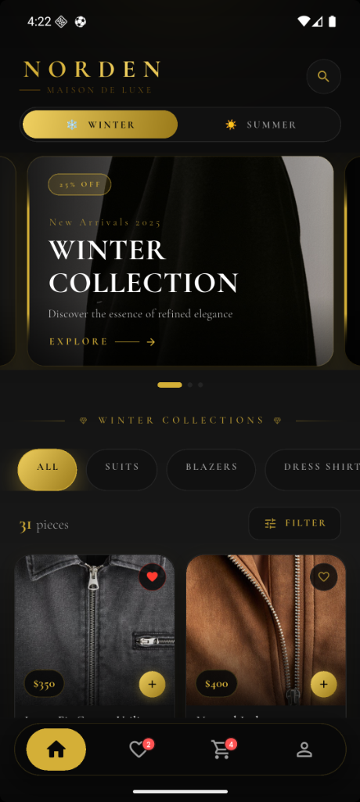
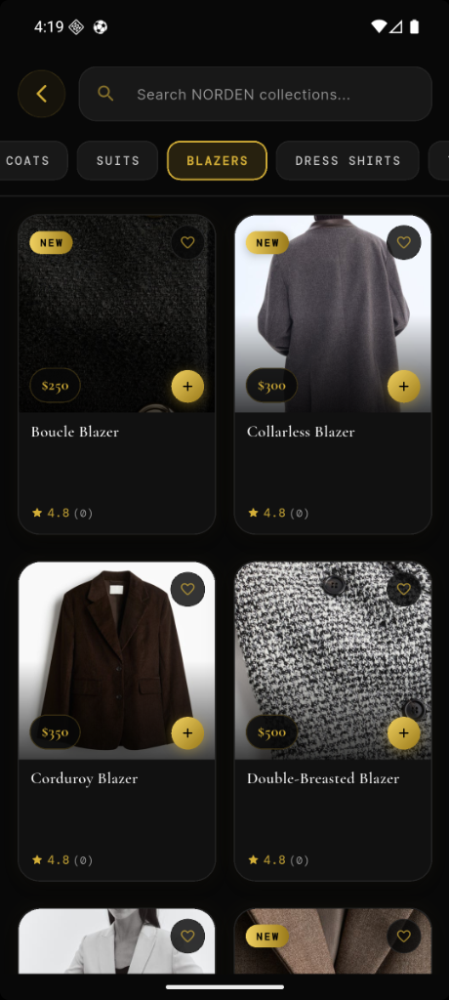
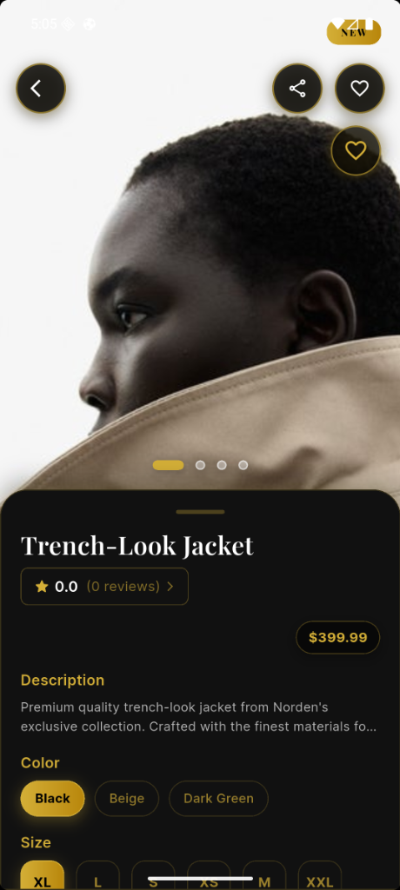
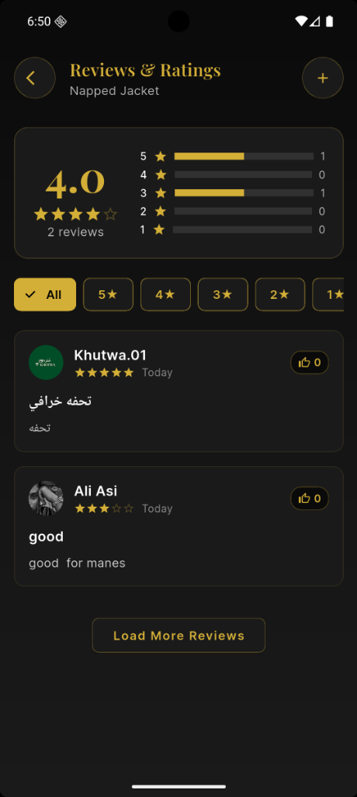

<p align="center">
  
</p>

<h1 align="center">NORDEN — Maison de Luxe</h1>

<p align="center">
  <em>A premium luxury men's fashion e-commerce mobile app built with Flutter</em>
</p>

<p align="center">
  
  
  
  
  
</p>

---

## 📸 Screenshots

<p align="center">
  
  
  
  
  
</p>

---

## ✨ Overview

**NORDEN** is a high-end men's fashion e-commerce application that delivers a premium shopping experience. The app features a stunning dark theme with gold accents, smooth animations, and a comprehensive set of features inspired by luxury fashion houses. It supports **seasonal collections** (Winter ❄️ & Summer ☀️), real-time product browsing, a full shopping cart with checkout, user reviews, wishlists, order tracking, and much more.

---

## 🏗️ Architecture

```
lib/
├── config/                  # App configuration
│   ├── api_config.dart      # Backend API endpoints & headers
│   ├── app_theme.dart       # Season-aware theme tokens (gold palette)
│   └── admin_config.dart    # Admin dashboard config
│
├── models/                  # Data models
│   ├── product.dart         # Product model with JSON serialization
│   ├── cart_item.dart       # Cart item model
│   ├── review.dart          # Review & ProductRating models
│   ├── wishlist_item.dart   # Wishlist item model
│   ├── address.dart         # Shipping address model
│   ├── category.dart        # Category model
│   ├── season.dart          # Season model
│   └── onboarding_page.dart # Onboarding page model
│
├── services/                # Business logic & API integration
│   ├── api_service.dart     # Base HTTP client (GET, POST, PUT, DELETE)
│   ├── auth_service.dart    # Auth wrapper
│   ├── backend_auth_service.dart      # JWT authentication (login, register, Google OAuth)
│   ├── backend_product_service.dart   # Product fetching & search
│   ├── backend_cart_service.dart      # Cart operations
│   ├── backend_wishlist_service.dart  # Wishlist CRUD
│   ├── backend_review_service.dart    # Reviews (fetch & create)
│   ├── backend_order_service.dart     # Order history
│   ├── backend_address_service.dart   # Address management
│   ├── backend_category_service.dart  # Category listing
│   ├── backend_season_service.dart    # Season toggle
│   ├── cart_service.dart          # Local cart state management
│   ├── wishlist_service.dart      # Local wishlist state management
│   ├── location_service.dart      # Geolocation & geocoding
│   ├── token_manager.dart         # JWT token storage & refresh
│   └── onboarding_service.dart    # Onboarding flow persistence
│
├── providers/               # State management
│   └── season_provider.dart # Season mode provider (Winter/Summer)
│
├── widgets/                 # Reusable widgets
│   ├── custom_bottom_navbar.dart    # Bottom navigation with badges
│   ├── google_maps_picker.dart      # Map-based location picker
│   ├── simple_map_picker.dart       # Simplified map picker
│   ├── map_picker.dart              # Map picker wrapper
│   ├── debug_maps_picker.dart       # Debug map picker
│   └── network_image_widget.dart    # Cached network image
│
├── screens/                 # App screens
│   ├── NordenIntroPage.dart         # Intro/welcome page
│   ├── onboarding_flow_page.dart    # Onboarding carousel
│   ├── location_setup_page.dart     # Post-signup location setup
│   ├── main_screen.dart             # Bottom nav host
│   ├── home_page.dart               # Home with carousel & product grid
│   ├── search_page.dart             # Search & category filtering
│   ├── product_details.dart         # Product detail with swipe-to-cart
│   ├── cart_page.dart               # Shopping cart
│   ├── checkout_page.dart           # Multi-step checkout
│   ├── order_tracking_page.dart     # Order tracking with timeline
│   ├── reviews_page.dart            # Product reviews & ratings
│   ├── add_review_page.dart         # Add a new review
│   ├── wishlist_page.dart           # Wishlist (legacy)
│   ├── profile_page.dart            # User profile hub
│   │
│   ├── login&sgin in/              # Authentication screens
│   │   ├── login.dart               # Email/password login
│   │   ├── signup.dart              # User registration
│   │   └── forgot_password.dart     # Password recovery
│   │
│   └── profile/                    # Profile sub-pages
│       ├── edit_profile_page.dart   # Edit name & phone
│       ├── wishlist_page.dart       # Wishlist (backend-connected)
│       ├── order_history_page.dart  # Order history list
│       ├── addresses_page.dart      # Saved addresses
│       ├── payment_methods_page.dart# Payment methods
│       └── customer_service_page.dart # Help & support
│
└── main.dart                # App entry point & routing
```

---

## 🚀 Features

### 🎨 Design & UX
- **Premium Dark Theme** — Elegant black & gold color palette inspired by luxury maisons
- **Season-Aware UI** — Dynamic switching between **Winter ❄️** and **Summer ☀️** collections with animated transitions
- **Smooth Animations** — Fade, slide, scale transitions, shimmer loading, and micro-interactions throughout
- **Haptic Feedback** — Tactile vibrations on key interactions for a premium feel
- **Google Fonts** — Typography using Playfair Display, Inter, Cormorant Garamond, DM Mono

### 🏠 Home Screen
- **Cinematic Carousel** — Auto-playing editorial announcements + featured product slides
- **Season Switcher** — Toggle between Winter & Summer with animated theme change
- **Category Tabs** — Browse by category (Suits, Blazers, Coats, Jackets, etc.)
- **Product Grid** — Staggered-entry product cards with:
  - Quick-add to cart button
  - Wishlist heart toggle with bounce animation
  - Price pill with sale badges
  - Color variant dots
  - NEW / SALE badges
- **Scroll-to-top FAB** — Gold floating action button appears on scroll

### 🔍 Search & Browse
- **Real-time Search** — Search across the entire product catalog
- **Category Filter Chips** — Quick category filtering
- **Product grid** with sorting and filtering options

### 📦 Product Details
- **Full-screen Image Carousel** — Swipeable product images with page indicators
- **Hero Animations** — Smooth transitions from grid to detail
- **Color & Size Selection** — Interactive selectors with gold highlight
- **Quantity Picker** — Increment/decrement with gold styling
- **Swipe-to-Add-to-Cart** — Slide action for premium cart experience
- **Wishlist Toggle** — Heart burst animation on favorite
- **Reviews & Ratings** — Star rating display with link to reviews page
- **NEW badge** — Golden badge for new arrivals

### ⭐ Reviews & Ratings
- **Rating Summary** — Average rating with distribution bar chart
- **Filter by Stars** — Filter chips for 1–5 star reviews
- **Review Cards** — User avatar, name, verified badge, rating, date, comment
- **Add Review** — Full review form with rating stars, title, comment, image upload
- **Backend Integration** — Reviews are fetched from and submitted to the real backend
- **Accessible to All** — Reviews visible to all users; guests prompted to sign in to post

### 🛒 Shopping Cart
- **Cart Items** — Product details with quantity, color, size
- **Price Summary** — Subtotal, shipping, total calculation
- **Quantity Adjust** — Inline quantity controls
- **Remove Items** — Swipe or tap to remove
- **Proceed to Checkout** — Seamless transition to checkout flow

### 💳 Checkout
- **Multi-step Process** — Address → Payment → Confirmation
- **Address Selection** — Choose from saved addresses or add new
- **Payment Methods** — Credit card with flip animation (Visa card effect)
- **Order Confirmation** — Success screen with order tracking link

### 📍 Location Services
- **Post-Onboarding Setup** — Location selected after account creation
- **Geolocation** — Auto-detect current location via GPS
- **Geocoding** — Reverse geocode coordinates to human-readable address
- **Backend Sync** — Location saved to user's authenticated account

### 👤 User Profile
- **Profile Overview** — User avatar, name, email, stats (Orders, Wishlist, Points)
- **Edit Profile** — Update display name & phone number via backend API
- **Order History** — View past orders with status badges (color-coded), date, total
- **Wishlist** — Backend-synced wishlist with pull-to-refresh
- **Saved Addresses** — Manage shipping addresses
- **Payment Methods** — Manage payment cards
- **Customer Service** — Help & support page
- **Sign Out** — Secure logout with token cleanup

### 🔐 Authentication
- **Email/Password Login** — Traditional authentication
- **User Registration** — Sign up with email, password, name
- **Google Sign-In** — OAuth-based Google authentication
- **Forgot Password** — Password recovery flow
- **Guest Mode** — Browse without an account
- **JWT Token Management** — Secure token storage with auto-refresh
- **Session Persistence** — Stay logged in across app restarts

### 📦 Order Tracking
- **Order Timeline** — Visual step-by-step tracking (Placed → Confirmed → Shipped → Delivered)
- **Status Badges** — Color-coded status indicators
- **Track Button** — Navigate from order history to tracking details

---

## 🛠️ Tech Stack

| Layer | Technology |
|---|---|
| **Framework** | Flutter 3.8+ |
| **Language** | Dart 3.8+ |
| **State Management** | Provider + ChangeNotifier |
| **HTTP Client** | `http` package |
| **Authentication** | JWT (Bearer Tokens) |
| **OAuth** | Google Sign-In |
| **Local Storage** | SharedPreferences + FlutterSecureStorage |
| **Maps** | Google Maps Flutter |
| **Location** | Geolocator + Geocoding |
| **Image Handling** | ImagePicker + CachedNetworkImage |
| **Typography** | Google Fonts |
| **UI Components** | Slide to Act, Flutter Flip Card |
| **Backend** | ASP.NET Core REST API |
| **Image CDN** | Cloudinary |
| **Platform** | Android (APK) |

---

## ⚙️ Getting Started

### Prerequisites
- Flutter SDK `^3.8.1`
- Dart SDK `^3.8.1`
- Android Studio / VS Code
- Android device or emulator

### Installation

1. **Clone the repository**
   ```bash
   git clone https://github.com/yourusername/norden.git
   cd norden/Norden
   ```

2. **Install dependencies**
   ```bash
   flutter pub get
   ```

3. **Run the app**
   ```bash
   flutter run
   ```

4. **Build APK**
   ```bash
   flutter build apk --debug
   # or for release:
   flutter build apk --release
   ```

5. **Install on device**
   ```bash
   flutter install
   ```

---

## 🌐 Backend API

The app connects to a live ASP.NET Core backend:

| Endpoint | Description |
|---|---|
| `POST /api/auth/login` | User login (returns JWT) |
| `POST /api/auth/register` | User registration |
| `POST /api/auth/google` | Google OAuth sign-in |
| `GET /api/products` | List products (paginated) |
| `GET /api/products/{id}` | Product details |
| `GET /api/categories` | List categories |
| `GET /api/seasons` | Get available seasons |
| `GET /api/cart` | Get user cart |
| `POST /api/cart` | Add item to cart |
| `DELETE /api/cart/{id}` | Remove cart item |
| `GET /api/wishlist` | Get user wishlist |
| `POST /api/wishlist` | Add to wishlist |
| `DELETE /api/wishlist/{id}` | Remove from wishlist |
| `GET /api/reviews/products/{id}` | Get product reviews |
| `POST /api/reviews/products/{id}` | Create review |
| `GET /api/orders` | Get order history |
| `POST /api/orders` | Place order |
| `GET /api/profile` | Get user profile |
| `PUT /api/profile` | Update user profile |
| `GET /api/addresses` | Get saved addresses |
| `POST /api/addresses` | Add new address |
| `POST /api/location` | Save user location |
| `GET /api/banners` | Get promotional banners |
| `GET /api/search?q=...` | Search products |

All authenticated endpoints require the header:
```
Authorization: Bearer <JWT_TOKEN>
```

---

## 🎨 Design System

### Color Palette

| Color | Hex | Usage |
|---|---|---|
| **Gold** | `#D4AF37` | Primary accent, buttons, badges |
| **Gold Light** | `#E8C547` | Gradient start |
| **Gold Dark** | `#B8860B` | Gradient end |
| **Background** | `#0A0A0A` | Main background |
| **Surface** | `#141414` | Cards, containers |
| **Surface 2** | `#1A1A1A` | Secondary surfaces |
| **Border** | `#2A2A2A` | Subtle borders |
| **Text** | `#FFFFFF` | Primary text |
| **Subtext** | `#888888` | Secondary text |
| **Red** | `#FF3B30` | Errors, hearts |
| **Green** | `#30D158` | Success states |

### Typography

| Font | Usage |
|---|---|
| **Playfair Display** | Headlines, product names, titles |
| **Cormorant Garamond** | Section labels, category tabs, luxury text |
| **Inter** | Body text, descriptions, form fields |
| **DM Mono** | Prices, badges, monospace accents |

---

## 📁 Key Dependencies

```yaml
dependencies:
  google_fonts: ^6.1.0          # Premium typography
  http: ^1.1.0                  # REST API calls
  shared_preferences: ^2.2.2    # Local key-value storage
  flutter_secure_storage: ^9.0.0 # Secure token storage
  image_picker: ^1.1.2          # Camera & gallery access
  url_launcher: ^6.3.1          # Phone calls & URLs
  google_maps_flutter: ^2.9.0   # Google Maps
  geolocator: ^13.0.1           # GPS location
  geocoding: ^3.0.0             # Address lookup
  google_sign_in: ^6.2.2        # Google OAuth
  slide_to_act: ^2.0.2          # Swipe-to-action widget
  flutter_flip_card: ^0.0.6     # Card flip animation
  cached_network_image: ^3.4.1  # Image caching
  provider: ^6.1.5+1            # State management
```

---

## 👥 Contributing

1. Fork the repository
2. Create your feature branch (`git checkout -b feature/amazing-feature`)
3. Commit your changes (`git commit -m 'Add amazing feature'`)
4. Push to the branch (`git push origin feature/amazing-feature`)
5. Open a Pull Request

---

## 📄 License

This project is proprietary software. All rights reserved.
© 2025-2026 NORDEN Maison de Luxe. Unauthorized copying, modification, or distribution is prohibited.

---

<p align="center">
  <strong>NORDEN</strong> — <em>Maison de Luxe</em><br/>
  <sub>Crafted with ❤️ and ☕ using Flutter</sub>
</p>
